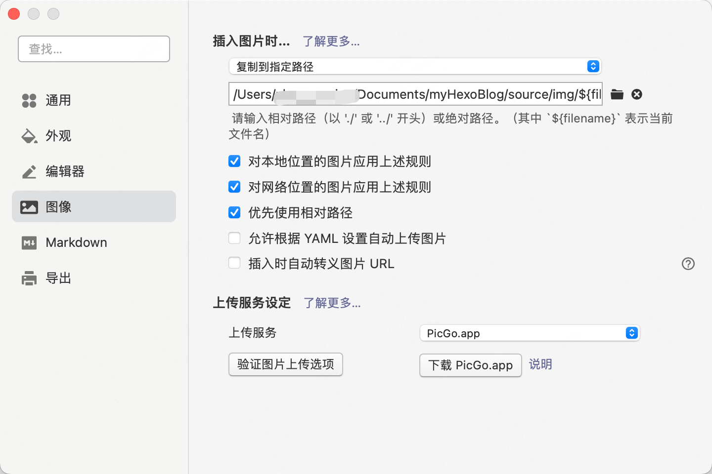

## typora 配置

1、打开typora设置->图像，选择“复制到指定路径”，路径：项目路径/source/img/${filename}

2、**更换编辑器或者电脑后，需要重新配置**

## hexo配置

_config.yml中，下面的配置改为true

post_asset_folder: true

## 已知问题

### 1、图片不能缩放

在typora中如果使用image标签缩放了图片，则无法在文章中展示
